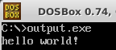
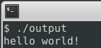
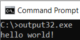
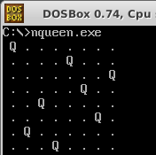
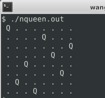
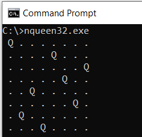

# mycc

A tiny C compiler of 2k lines of codes, generates pure x86 asm code for DOS/Win32/Linux 3 backends.





Mycc supports a reasonable subset of the C language. Check [tests](https://github.com/wangyu-/mycc/tree/master/tests) and [examples](https://github.com/wangyu-/mycc/tree/master/examples) folder to get an idea of what mycc can compile. Below are some examples: 

[nqueen.c](https://github.com/wangyu-/mycc/blob/master/examples/nqueen.c) is a mycc-compilable program that finds a solution for the n queen puzzle:

```
 Q . . . . . . .
 . . . . Q . . .
 . . . . . . . Q
 . . . . . Q . .
 . . Q . . . . .
 . . . . . . Q .
 . Q . . . . . .
 . . . Q . . . .
```

[sudoku.c](https://github.com/wangyu-/mycc/blob/master/examples/sudoku.c) is a mycc-compilable program that fills the sudoku game for you:
```
input:                                       output:
 1 . 3 | . . . | 5 . 9                       1 4 3 | 6 2 8 | 5 7 9
 . . 2 | 1 . 9 | 4 . .                       5 7 2 | 1 3 9 | 4 6 8
 . . . | 7 . 4 | . . .                       9 8 6 | 7 5 4 | 2 3 1
-------+-------+------                      -------+-------+------
 3 . . | 5 . 2 | . . 6                       3 9 1 | 5 4 2 | 7 8 6
 . 6 . | . . . | . 5 .                       4 6 8 | 9 1 7 | 3 5 2
 7 . . | 8 . 3 | . . 4                       7 2 5 | 8 6 3 | 9 1 4
-------+-------+------                      -------+-------+------
 . . . | 4 . 1 | . . .                       2 3 7 | 4 8 1 | 6 9 5
 . . 9 | 2 . 5 | 8 . .                       6 1 9 | 2 7 5 | 8 4 3
 8 . 4 | . . . | 1 . 7                       8 5 4 | 3 9 6 | 1 2 7
 ````


Mycc supports the syntax of embeding asm codes into C, mycc compiled programs are able to do syscall directly on their own:

```
char getc()
{
  char a;
  a=0;
  __asm
  {
        mov eax, 3      ;the syscall num of "read()" on linux 
        mov ebx, 0      ;read from stdin, 0 is the fd of stdin
        mov ecx, a@getc      ;save the result to the address of variable "a" inside function "getc"
        mov edx, 1      ;read 1 character
        int 0x80
  }
  return a;
}
```

Mycc is shipped with a built-in library (check [lib](https://github.com/wangyu-/mycc/tree/master/lib) and [lib.platform](https://github.com/wangyu-/mycc/tree/master/lib.platform)), implemented in the language of mycc itself.  Becasue of this, unlike most other tiny compilers, mycc generates "pure asm" codes that runs independently, without the need of linking to external libraries (e.g. libc). 

# How to use
make sure you have `nasm` installed.
##### 1 build mycc with make:
```
make
```
##### 2a To compile for Linux backend:
```
./mycc <examples/nqueen.c elf32
nasm -f elf32 output.asm
ld -m elf_i386 output.o -o nqueen.out
```
Then `nqueen.out` is the run-able binary on linux. 

##### 2b To compile for DOS backend:
```
./mycc <examples/nqueen.c bin
nasm -f bin output.asm -o nqueen.exe
```
Then `nqueen.exe` is the run-able binary on DOS. 

##### 2c To compile for Win32 backend:
```
./mycc <examples/nqueen.c win32
nasm -f win32 output.asm
ld -m i386pe output.obj kernel32.dll -o nqueen32.exe        #(you need a copy of kernel32.dll)
```
Then `nqueen32.exe` is the run-able binary on windows.

###### Note: all commands above run under linux. 

##### 3. all done, copy the binaries to the corresponding platforms and run.

  
# Easy testing with helper script

`run.sh` is a helper script for easy testing, to make full use of this script you need `dosbox` and `wine` installed.

For linux backend:
```
./mycc <examples/nqueen.c elf32
./run.sh
```

For dos backend:
```
./mycc <examples/nqueen.c bin
./run.sh
```
###### (it runs the compiled program inside `dosbox`)

For windows backend:
```
./mycc <examples/nqueen.c win32
./run.sh
```
###### (it runs the compiled program inside `wine`)
